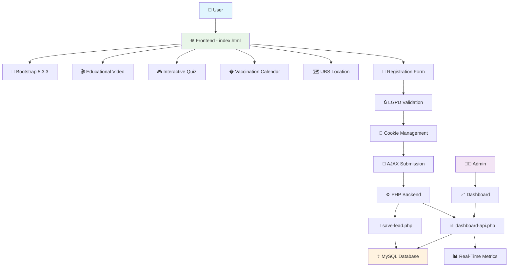
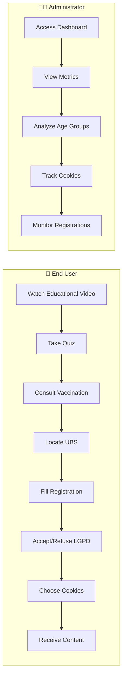

# 🏠 Living Well in the Best Age

> Educational platform about medicines, vaccines, and health care for seniors

[](https://php.net)
[](https://mysql.com)
[](https://getbootstrap.com)
[](https://developer.mozilla.org/en-US/docs/Web/JavaScript)
[](https://www.gov.br/cidadania/pt-br/acesso-a-informacao/lgpd)

<div align="center">
  <h3 style="margin-bottom:12px">📸 Screenshot Project</h3>
  
  <br>
  <span style="color:#6c757d; font-size:0.95em;">
    <strong>Preview:</strong> Full-page screenshot of the platform interface.
  </span>
</div>

## 🎯 Overview

A web educational system focused on seniors (60+ years) offering essential information about medicines, vaccination calendar, interactive quizzes, and responsible disposal of medicines. Includes a complete lead capture system with full LGPD compliance and a real-time administrative dashboard.

## 🏗️ System Architecture



## 📋 Use Cases



## 🚀 Features

### 🎯 Core Features
- **🎬 Educational Video** - Content about responsible medicine disposal
- **🎮 Interactive Quiz** - Educational Q&A system
- **� Vaccination Calendar** - Complete table for 60+ seniors
- **🗺️ UBS Location** - Integrated with Google Maps (Anápolis-GO)
- **💳 Flashcard System** - Interactive informative cards
- **�📋 Lead Registration** - Full system with real-time validation
- **🔒 LGPD Compliance** - Mandatory consent modal
- **🍪 Cookie Management** - Granular preference control
- **📊 Admin Dashboard** - Real-time metrics with auto-refresh

### 🎨 Interface & UX
- **📱 Responsive Design** - Bootstrap 5.3.3, mobile-first
- **♿ Accessibility** - Focused on seniors (60+)
- **🎨 Clean Visuals** - Simple, intuitive interface
- **⚡ Performance** - Optimized loading with lazy loading

### 📈 Analytics & Reports
- **📊 Metrics by Age Group** - 60-70, 71-80, 81-90, 91-100, 100+
- **📅 Registrations by Period** - Last 7 days
- **🍪 Cookie Distribution** - Accepted / Refused / No choice
- **📋 Lead List** - Real-time visualization

## 🛠️ Tech Stack

| Layer        | Technology      | Version           | Purpose               |
| ------------ | --------------- | ----------------- | --------------------- |
| **Frontend** | HTML5/CSS3/JS   | ES6+ (ECMAScript) | User interface        |
| **CSS FW**   | Bootstrap       | 5.3.3             | Responsive design     |
| **Backend**  | PHP             | 8.2.12            | Business logic        |
| **Database** | MySQL           | 8.0+              | Data persistence      |
| **Web Server** | Apache         | 2.4+ (XAMPP 3.3.0)| HTTP Server           |
| **Environment** | XAMPP         | 3.3.0             | Development stack     |
| **Compliance** | LGPD           | -                 | Data protection       |

## 📁 Project Structure

```
anhanguera-extension-project-II/
├── 📄 index.html                     # Main page
├── 📄 README.md                      # Project documentation
├── 📁 css/
│   └── custom.css                    # Custom styles
├── 📁 js/
│   ├── main.js                       # General features
│   ├── form-validation.js            # Form validation
│   ├── privacy.js                    # LGPD/Cookie management
│   ├── quiz-data.js                  # Quiz data
│   ├── quiz-dom.js                   # Quiz DOM manipulation
│   ├── quiz.js                       # Main quiz logic
│   ├── audio-system-new.js           # Audio system
│   └── flashcards.js                 # Flashcard system
├── 📁 php/
│   ├── conect.php                    # DB connection
│   ├── save-lead.php                 # Lead processing
│   ├── dashboard.php                 # Admin dashboard UI
│   └── dashboard-api.php             # Metrics API
└── 📁 videos/
    ├── descarte-medicamentos.mp4     # Educational video
    └── thumb-descarte.svg            # Video thumbnail
```

## ⚙️ Installation & Setup

### 📋 Prerequisites
- XAMPP/WAMP/LAMP Stack
- PHP 8.0 or higher
- MySQL 8.0 or higher
- Modern browser

### 🔧 Database Setup

```sql
-- Create database
CREATE DATABASE projeto_extensao_2;

-- Create leads table
CREATE TABLE leads (
    id INT AUTO_INCREMENT PRIMARY KEY,
    nome VARCHAR(100) NOT NULL,
    email VARCHAR(100) NOT NULL UNIQUE,
    telefone VARCHAR(20),
    idade VARCHAR(20) NOT NULL,
    lgpd_consent TINYINT(1) DEFAULT 0,
    cookies_accepted TINYINT(1) DEFAULT NULL,
    data_cadastro TIMESTAMP DEFAULT CURRENT_TIMESTAMP,
    data_lgpd_aceite TIMESTAMP NULL
);
```

### 🚀 Deploy

1. **Clone/Copy** files to `htdocs/anhanguera-extension-project-II/`
2. **Configure** DB credentials in `php/conect.php`
3. **Import** database schema
4. **Access** `http://localhost/anhanguera-extension-project-II/`

## 📊 Metrics & Monitoring

### 📈 Main KPIs
- **LGPD Consent Rate**: 100% (mandatory modal)
- **Cookie Distribution**: Accepted vs Refused vs No choice
- **Main Age Group**: 60+ (target audience)
- **Lead Growth**: Last 7 days

### 🔍 Dashboard Features
- ⏱️ **Auto-refresh** every 30 seconds
- 📊 **Interactive charts** and visual counters
- 📋 **Real-time lead list**
- 📱 **Responsive mobile interface**

## 🔒 Compliance & Security

### ✅ LGPD (General Data Protection Law)
- **Mandatory consent modal**
- **Granular cookie management**
- **Full transparency** on data usage
- **Right to be forgotten** implemented

### 🛡️ Security
- **Server-side validation** in PHP
- **Input sanitization** with PDO
- **XSS prevention** via output escaping
- **Client-side validation** in JavaScript

## 🎯 Target Audience

- **👵 Seniors 60+** - Platform's main focus
- **👨‍⚕️ Caregivers** - Family and professionals
- **🏥 Health Professionals** - Reference and guidance

## 📞 Support & Contact

- **🌐 URL**: `http://localhost/anhanguera-extension-project-II/`
- **📊 Dashboard**: `http://localhost/anhanguera-extension-project-II/php/dashboard.php`
- **📱 WhatsApp**: (62) 98158-9221
- **📁 Repository**: Local source code

---

## 📄 License

Licensed under the [MIT License](LICENSE).

---

<p align="center">
  <a href="https://www.linkedin.com/in/pedrosolozabal/">
    
  </a>
  <br>
  <a href="https://github.com">
    
  </a>
  <a href="https://www.gov.br/cidadania/pt-br/acesso-a-informacao/lgpd">
    
  </a>
</p>